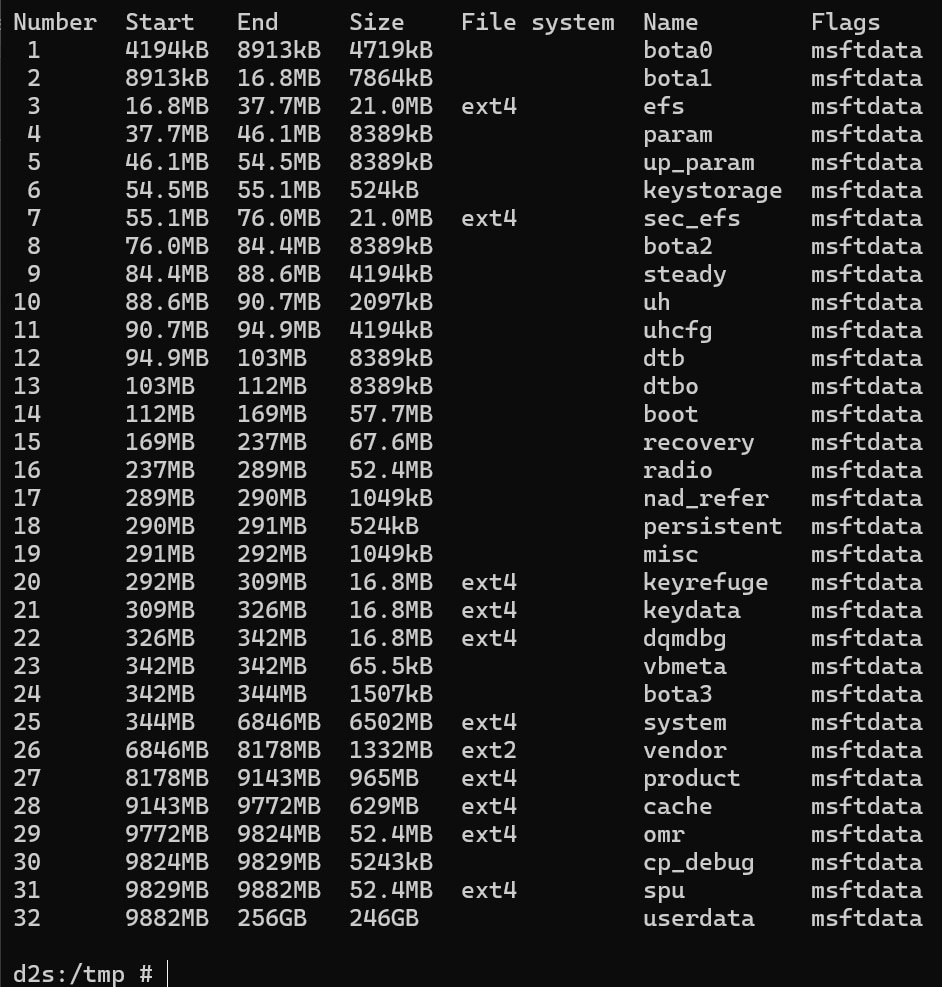

# Hello, this is a Guide on how to potentially dualboot on Exynos devices.

## - RISKS:
### - If you are stupid you can brick your phone (i am not responsible for that)

## - Problems: 
### - Your Storage could be too small. On devices below 128GB storage, I don't recommend this, so you know.
### - You need a pc for the setup... Mac device or Linux device also works.
### - You need to use TWRP for that. I haven't tried another Recovery yet.
### - You have to format your data

## EXAMPLE DEVICE: Samsung Galaxy Note 10+, 256GB ROM 12GB RAM
### - You download Parted from my "tools" folder
### - ```adb push path/to/parted /sbin```
### - ```adb shell```
### - ```chmod +x /sbin/parted```
### - ```parted /dev/sda p```

### - now you should see all your phones partition. 
### - Somewhere at the bottom you see ```system vendor odm userdata```
### - Save the list somewhere
### - enter ```parted /dev/sda```
### - now we are in a parted commandline. CAUTION: some stuff dont work like you are used to. watch out.
### - ```rm part {number of userdata/USERDATA}```
### - now we make the partitions
### - ```mkpart system ext4 {blocks from} {blocks to}```
### - "hold up, what the fuck does "blocks from" and "blocks to" mean?"

### - calm calm, lemme explain:



### - here you can see a healthy partition table from my Note 10+
### - at the top you can see "Start" and "End". This is what i mean with "blocks from" and "blocks to"

### - so if you make system you would do in my case
### - ```mkpart system2 ext4 9882 16384```
### - "but how do you know what size to enter there?"
### - look at the system size there, in the collumn "Size". take a calculator, add the userdata "End" number and the system size. then we stick to the stock partitons. if you want, you can make them bigger. but no need mostly.
### - you do the same for every partition needed by your device.
### - ```mkpart vendor2 ext4 16384 17716```
### - ```mkpart product2 ext4 17716 18681```

### - now to the funny part. making userdata partitions. 
### - in my case i took the data thats left soooo (18681 - 249000) / 2 = 115160 for userdata 1 and 115158 for userdata 2

### - ```mkpart userdata ext4 18681 1151560```
### - ```mkpart userdata2 ext4 1151560 249000```

### - if you are done with that, restart into your recovery once.
### - repeat adb push adb shell chmod parted thing

### - now you should see the new partitions
### - now we need to name them, because parted doesnt do that by itself

### - it works like this: ```name [partitionnumber] [name]```
### - for example: ```name 25 system```, ```name 26 system2``` and so on
### - once this is done, reboot to recovery.
### - now we have to format most partitions by outselves. depending on what phone you have we have to format partition different formats.
### - we can go to adb shell once more. try to ```ls /dev/block/by-name```, to maybe see your new partitions.
### - if your TWRP has been made normal, we can just start by going to "wipe" and press format data.
### - Then you can use data partition already.
### - after that you can continue by entering ```mkfs.f2fs /dev/block/by-name/userdata2``` IF your rom supports F2FS /data.
### - if not use ```mke2fs```: ```mke2fs -t ext4 -F /dev/block/by-name/[partitions]```

### - Once you are done with formatting your partitions accordingly, we have to make a zip to dynamically name the partitions, for the dualboot.
### - Download this REPO, and open the "rename" folder.
### - Push parted once more and get the partition list. this is important, because we need the partition numbers from the NEW partitions.
### - Go into the folder rename and open the file worker.sh
### - Correct everything needed. Add Boot.img Dtb.img and Dtbo.img to that same folder.
### - Compress the contents INSIDE the folder into a zip.
### - Make an 2nd zip where you rename the partitons accorindly to boot the other OS. dont forget to replace the imgs of that rom in there.
### - If that is all done you can try it. You may have to troubleshoot some stuff, but i am sure if you followed this tutorial this far that you will know how to do that. 
### - Have fun, if you have questions open an issue and i am sure that we can find an awnser.

### - to flash a rom flash a rename zip, reboot to recovery, flash rom, flash rename zip, reboot to recovery, flash rom!

# GOOD LUCK
